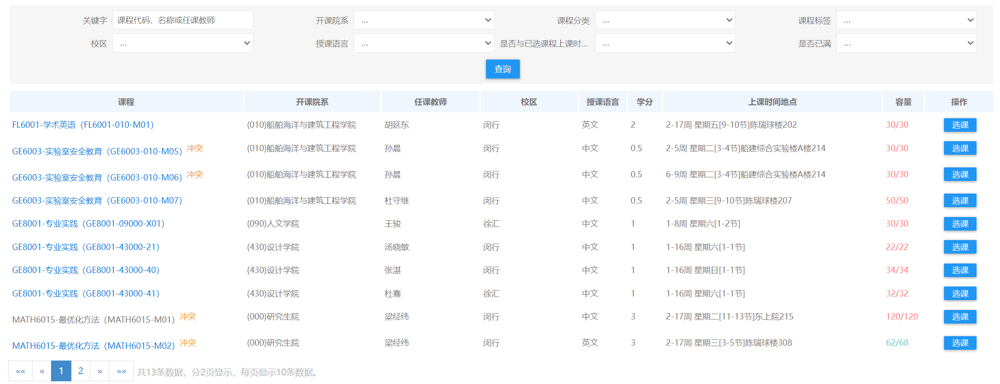
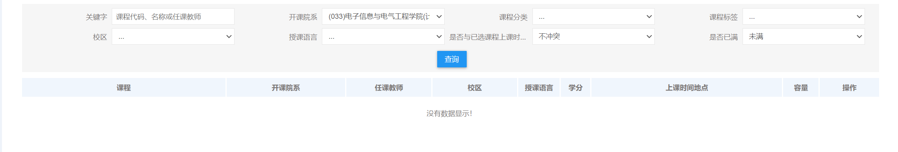
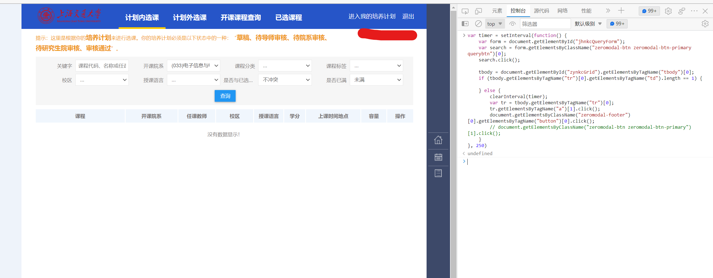
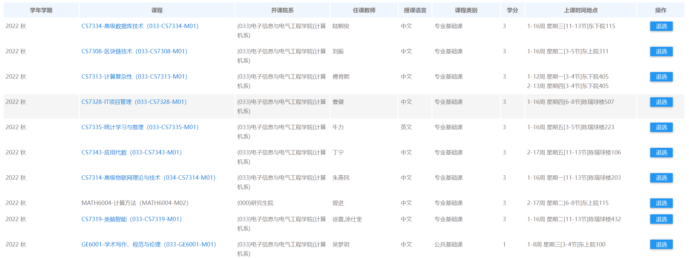

# STJU_TakeCourse
上海交通大学研究生抢课脚本

## 使用方法

1.进入选课页面。

2.选择想要选课的条件，例如：校区-闵行，是否与已选课程上课时间冲突-不冲突，是否已满-为满，开课院系-电院计算机系。

3.按下F12进入开发者模式，点击控制台，把JS代码粘贴进控制台，回车，脚本开始运行。

## 注意

1.只有当有课可选，脚本选了之后，脚本的循环才会停止，不论是否成功选上。

2.每次只能抢一个课，抢完一个课之后要再输入一次代码回车。

3.代码最后的250是250ms刷新一次的意思，自己可以随便改。

## 抢课成果

我所有的课都是脚本抢到的，除了下面这几门课我还退了两门课。

